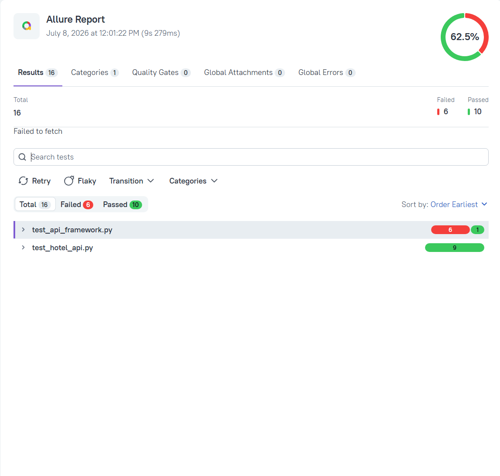
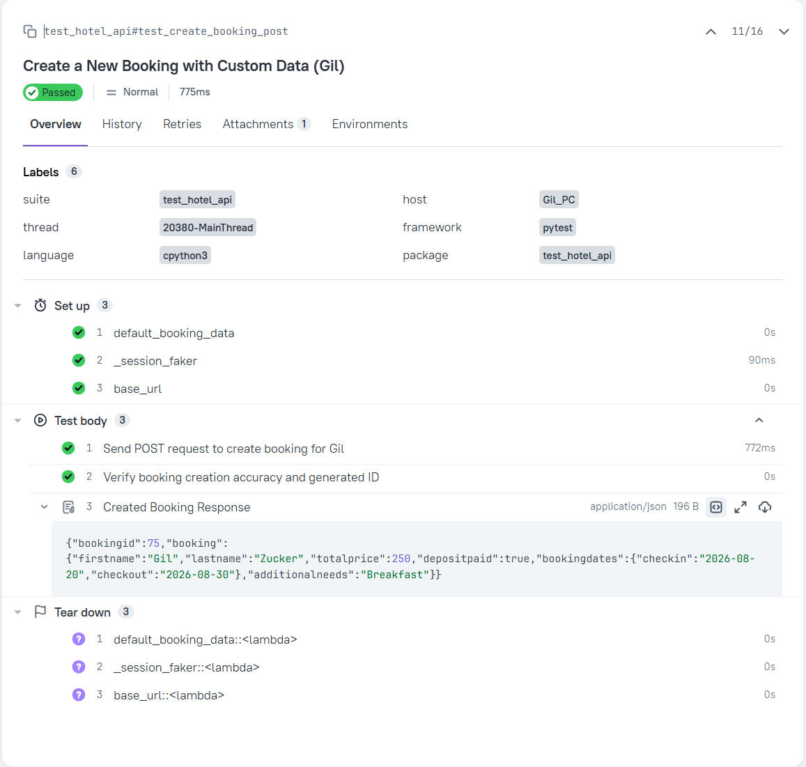

# 🏨 My API Hotel Booking Project

A professional API automation testing framework built with **Python**, **Pytest**, and **Requests**, featuring comprehensive test coverage and advanced **Allure Reporting**.

---

## 🚀 Key Features Demonstrated
* **Full CRUD Operations:** Automated testing of GET, POST, PUT, and DELETE endpoints.
* **Smart Infrastructure:** Centralized configuration using Pytest `conftest.py` and reusable dynamic fixtures.
* **Session & Token Management:** Automated admin authentication to securely fetch and inject bearer tokens into request cookies.
* **Data-Driven & Validation:** Dynamic payload testing, strict data-type assertions, and query parameters filtering logic.
* **Negative & Security Testing:** Explicit boundary testing and verification of unauthorized access blocks (403 Forbidden).

---

## 📊 Live Execution Reports (Allure)
The framework is fully integrated with **Allure Report**, translating raw technical test executions into highly readable graphical dashboards.

<table border="0">
  <tr valign="bottom">
    <td width="50%" align="center">
      <b>1. Test Execution Dashboard</b><br>
      <i>Displays a ~62.5% pass rate due to live public environment data volatility.</i><br><br>
      
    </td>
    <td width="50%" align="center">
      <b>2. Technical Suites & Steps</b><br>
      <i>Demonstrates custom titles, layered steps, and dynamic JSON attachments.</i><br><br>
      
    </td>
  </tr>
</table>


---

### ⚠️ Environment & Test Stability Note (Real-World QA Insights)
When running this framework against the public, shared `restful-booker` live server, you might occasionally observe some failed tests (e.g., a ~62% pass rate). 

As a professional QA Automation Engineer, this is a calculated and expected behavior due to **Shared Environment State**:
1. **Data Volatility:** Multiple automation scripts worldwide constantly modify, update, and delete bookings (like IDs 10 and 11) simultaneously.
2. **Hardcoded vs. Dynamic Dependencies:** While local execution against a stable `localhost` database yields 100% success, live public end-points naturally suffer from environment instability.

**How to address this in a production framework:**
In an enterprise environment, this would be resolved by using isolated test environments (Dockerized containers), running DB seed scripts before each execution to ensure a clean state, or using dynamic data creation exclusively instead of targeting static IDs.


## 🛠️ Tech Stack & Libraries
* **Language:** Python 3
* **Test Runner:** Pytest
* **HTTP Client:** Requests
* **Reporting Framework:** Allure Report (`allure-pytest`)

---

## 💻 How to Run the Project Locally

1. **Clone the repository:**
   ```bash
   git clone <YOUR_REPOSITORY_URL_HERE>
   cd API_project_demo

1. Install required dependencies:\
 
   ✅ `pip install requests pytest allure-pytest`

3. Execute tests and generate Allure logs:\

   ✅ `pytest --alluredir=allure-results`

5. Open the graphical Allure report in your browser:\

   ✅ `allure serve allure-results`


